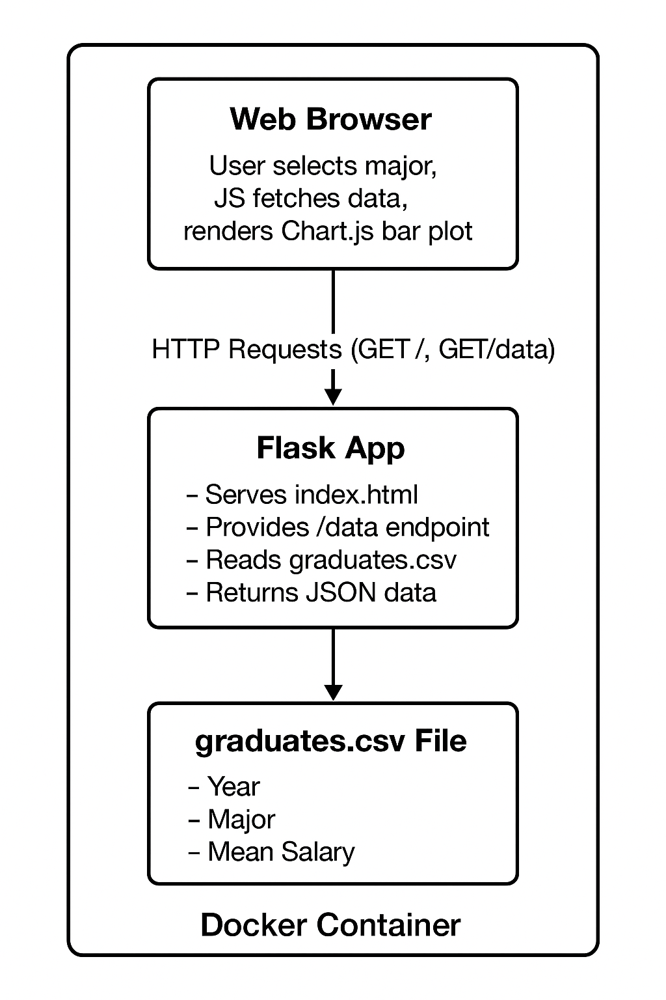
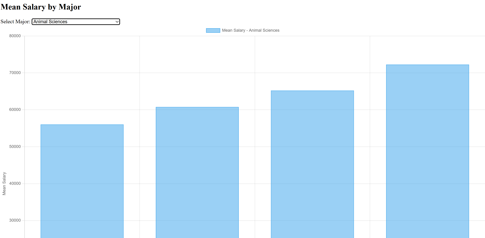

# Executive Summary

## Problem: What problem are you solving, and for whom?

The problem I am solving is that I want to be able to clearly visualize the mean salary for each major from this graduates.csv dataset. This would solve a problem for college boards that are trying to see how successful each major is and how profitable each major has proven to be over time. In addition, this would prove useful to students who are curious about the mean salaries for various majors, so if a major they were interested in pays very little, they could at least be aware of that when they declare their major.

## Solution: One paragraph, non-technical overview of your project.

I created a webpage that will display a bar graph of the mean salary of each major in the graduates.csv dataset. The dataset includes various information on education, work status, and salary, but we are looking specifically at the average profit for each type of major. Therefore, I created an app.py file and an index.html file that pull the mean salary for each major, and every year that there are mean salaries listed. The app.py file retrieves the mean salary data for each year, for the major that is selected on the dropdown menu in the webpage itself.

# System Overview

## Course Concept(s): Name the specific module concept/tool you used

I worked based on Case 4 and 5 with Flask API where we create a backend app.py file and a frontend index.html file and connect them using Flask. I created get requests in the app.py file to pull the dataset and then pull the mean salary for each major based on the dropdown that was outlined in the index.html file. In addition, I encased both files and the dataset within a Dockerfile so that they could be run in a container, making the project more portable.

## Architecture Diagram: Include a PNG in /assets and embed it here

## Data/Models/Services: List sources, sizes, formats, and licenses

https://corgis-edu.github.io/corgis/csv/graduates/

This dataset is from Corgis under the Graduates folder.

# How to Run (Local)

My Dockerfile startup command: 

docker build --no-cache -t finalcasestudy . | docker run -p 5000:5000 finalcasestudy

# Design Decisions

## Why this concept? Alternatives considered and why not chosen.

I ultimately thought that this method of visualizing the data would be the best because the bar graph makes it easy to distinguish the trend of the mean salary data by year for each major. Originally, I had created a scatterplot, but it was difficult to see the trend as easily and did not make sense considering that I was visualizing one categorical data column and one numerical data column.

## Tradeoffs: Performance, cost, complexity, maintainability

The performance of the website is strong because there is not much delay between pulling the data for each major and creating a bar graph for it. The cost of maintaining the website would be near to none because you are using a public dataset and it would only cost as much as maintaining a webapp on Azure or AWS would cost. In addition, this concept is fairly simple, which would make it fairly reproducible for different datasets, given that you change the app.py file and the index.html file to work for the given dataset and the data you want to visualize.

## Security/Privacy: Secrets management, input validation, PII handling

There are no secrets on this project, as indicated in the .env.example file included in the Github Repository. My UI in the webapp implicitly validates inputs by creating a dropdown menu with only the valid majors listed, so that the user of the webapp cannot input invalid majors. Because all my information is from a public dataset (graduates.csv), there is no PII handling because there is no personal information included in this project or necessary to run it.

## Ops: Logs/metrics, scaling considerations, known limitations

The logs on my project generally do not display specific errors because there are not any possible errors on the user side because of the dropdown menu. My project currently does not track any metrics. A scaling consideration is that if you were to include a dataset that were significantly larger, it would be harder to use effectively because of load times. Generally, because of how my project is laid out, if the project were to be scaled up, it would soon become slower because of larger datasets that create slower JSON responses. In addition, my project only handles one request at a time and therefore cannot handle concurrent users. Also, because of the dataset that was chosen, some majors have far less data than others, and therefore it is difficult to compare the majors to each other.

# Results & Evaluation

## Screenshots or sample outputs (place assets in /assets)

## Validation/tests performed and outcomes

Initially, there were many problems with getting the right data to be visualized and then actually visualizing it without an error on the webapp. But once the code was correctly written in the app.py file and the index.html file, scatterplots were created for each major. However, because the scatterplots did not prove to be visually easy to analyze, I changed the index.html file to display bar graphs so that the trend is more easily clear to the eye.

# What’s Next

## Planned improvements, refactors, and stretch features

An improvement would be to be able to compare different majors by displaying their graphs side by side. In addition, ensuring that all the majors have data for the same years so that they can be compared. That may require using the years of the more populated major in terms of how much data they have. I could create a load_data function that would be a refractor because it would make it easier to test visualizing the data I use. In the same vein as viewing multiple majors at once, a stretch feature I would like to be able to also look at a majors median salary, 25th percentile salary, and 75th percentile salary.

# Links (Required)

### Github Repo:

https://github.com/Ryanmh1024/final-case-study 